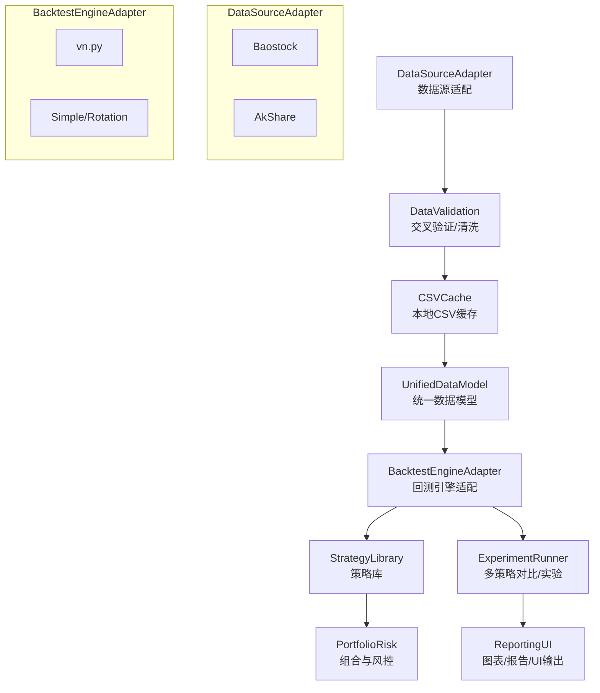

Balance Wheel

## 框架总览

面向个人、低成本量化策略回测平台的目标是：以可插拔的数据源与回测引擎为核心，支持单标的、轮动与组合策略，多策略对比与可视化输出，
并确保可复现实验与排错（trouble shooting）。

### 模块总览（逻辑图）



### 数据与流程

1. 数据拉取：通过 DataSourceAdapter 抽象接口接入数据源（初期 baostock + akshare），对同一标的、区间进行交叉验证。
2. 数据缓存：清洗后落地为 CSV，以路径与命名规范管理版本（便于可复现）。
3. 回测执行：统一数据模型进入 BacktestEngineAdapter（默认 vn.py / 简易 / 轮动引擎），注入策略与风控组件。
4. 实验对比：ExperimentRunner 以 baseline + variant 方式批量执行，输出对比指标并做 Welch t 检验。
5. 可视化输出：ReportingUI 生成收益曲线、回撤曲线、对比图等图片（无 matplotlib 则落地 CSV）。

### 目录结构建议

```
modules/
  data_sources/         # 数据源适配、交叉验证、CSV缓存
  backtest_engine/      # vn.py/简易/轮动 引擎与统一回测接口
  strategies/           # 单标的/轮动/组合策略
  portfolio_risk/       # 风控与组合管理
  experiment_runner/    # 多策略对比与实验管理
  reporting_ui/         # 图表与UI输出
  pipeline/             # 串联与端到端流程
```

### 最低可行版本（MVP）

1. 数据源适配：baostock + akshare 交叉验证并落地 CSV。
2. 回测引擎：vn.py/简易引擎/轮动引擎，统一回测接口。
3. 策略示例：单标的均线交叉，下午 14:50 近一月涨幅择时（创业板ETF vs 纳指ETF）。
4. 多策略对比：baseline + variant 批量回测，输出指标表与显著性检验。
5. 图表输出：回测结束生成收益曲线/对比叠加图（PNG 或 CSV）。

## 快速开始（MVP 跑通示例）

1) 安装依赖（可根据需求选择最小集合）：

```bash
pip install akshare baostock pandas matplotlib
# 如需使用 vn.py CTA 回测：
pip install vnpy vnpy_ctastrategy
```

2) 跑通均线交叉示例（默认 synthetic 数据 + 简易引擎）：

```bash
python -m modules.pipeline.run --symbol SYNTH --data-source synthetic --engine simple \
  --csv-path data/synth --output-dir reports/demo
```

3) 使用真实数据与 vn.py 引擎（示例：baostock 日线，不复权）：

```bash
python -m modules.pipeline.run --symbol sh.600000 --data-source baostock --engine vnpy \
  --start 2020-01-01 --end 2020-12-31 \
  --csv-path data/baostock --output-dir reports/baostock_ma
```

4) 使用 akshare 数据源（等效指令，可改为 akshare 支持的代码格式，如 `000001`）：

```bash
python -m modules.pipeline.run --symbol 000001 --data-source akshare --engine simple \
  --start 2020-01-01 --end 2020-12-31 \
  --csv-path data/akshare --output-dir reports/akshare_ma
```

5) 跑通 14:50 近一月涨幅择时策略（创业板ETF 159915 vs 纳指ETF 159941，涨幅 >0.1% 取最大，否则空仓模拟逆回购）：

```bash
python -m modules.pipeline.run --preset afternoon_etf --data-source akshare --engine simple \
  --start 2021-01-01 --end 2021-12-31 \
  --chinext-symbol 159915 --nasdaq-symbol 159941 \
  --csv-path data/rotation --output-dir reports/afternoon_etf
```

6) 使用自定义策略参数（JSON/YAML），例如 `ma_strategies.yaml`：

```yaml
baseline:
  type: ma_cross
  short_window: 5
  long_window: 20
  position_size: 1.0
slow_variant:
  type: ma_cross
  short_window: 10
  long_window: 30
  position_size: 1.0
```

运行：

```bash
python -m modules.pipeline.run --strategy-config ma_strategies.yaml --output-dir reports/ma_config_demo
```

## 输出内容
- `reports/<run>/strategy_name/`：指标文本 + 单策略权益图/CSV。
- `reports/<run>/overlay.png`：多策略叠加图（或 CSV）。
- `reports/<run>/metrics_table.csv`：策略指标汇总（收益、回撤、Sharpe、Sortino、Calmar、波动率、胜率）。
- `reports/<run>/significance.csv`：基于日收益的 Welch t 检验结果。

